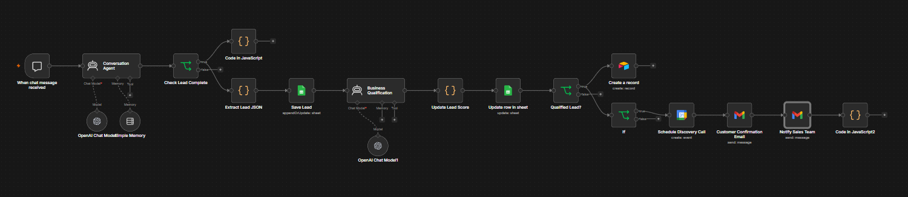

# 🤖 AI Lead Qualification Assistant

An AI-powered lead qualification workflow built using **n8n** that automates customer interactions, evaluates lead quality, and performs business actions such as lead storage, meeting scheduling, and email notifications.

---

## 📌 Selected Problem Statement

**Option 2: AI Lead Qualification Assistant**

Build an AI assistant that interacts with potential customers, collects business requirements, qualifies leads, extracts structured information, and triggers automated business workflows.

---

## 🔄 Workflow Explanation

1. Customer initiates a conversation through the chat interface.
2. AI collects customer information using contextual follow-up questions.
3. Lead details are extracted into structured JSON.
4. A second AI evaluates the lead based on business criteria and assigns a score and priority.
5. Lead information is stored in Google Sheets and Airtable.
6. Qualified high-priority leads automatically trigger:
   - Google Calendar meeting creation
   - Sales team notification
   - Customer confirmation email

---

## 🧠 AI Model Used

- **OpenAI GPT-4.1** (via n8n AI Agent)
- Conversation memory enabled for context-aware interactions.
- AI is used for:
  - Customer conversation
  - Information extraction
  - Lead qualification
  - Business decision making

**AI Prompts:**
- [Conversation AI Prompt](Conversation%20AI%20prompt.txt)
- [Lead Qualification AI Prompt](Lead%20Qualifiaction%20Ai.txt)

---

## 🔗 External Integrations

- Google Sheets
- Gmail
- Google Calendar
- Airtable

---

## ⚙️ Setup Instructions

1. Import the workflow into n8n.
2. Configure credentials for:
   - OpenAI
   - Google Sheets
   - Gmail
   - Google Calendar
   - Airtable
3. Update the Sheet ID, Airtable Base ID, and email addresses.
4. Activate the workflow.
5. Start chatting through the Chat Trigger.

---

## 🚀 Future Improvements

- Voice-based interaction
- WhatsApp/Slack notifications
- Human approval workflow
- Duplicate lead detection
- Analytics dashboard
- Multi-language support
- Enhanced error handling & retry logic

---

**Author:** Anas Mirza